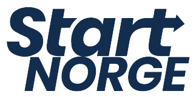

# TDT4252 - Enterprise Architecture for Enterprise Innovation

## Table of Contents
- [Project Overview](#project-overview)
- [Goal](#goal)
- [Methodology](#methodology)
- [File Structure](#file-structure)
- [Key Outputs](#key-outputs)
- [Applications](#applications)
- [Conclusion](#conclusion)

## Project Overview
This project is part of the **TDT4252 - Enterprise Architecture for Enterprise Innovation** course. The goal of this project is to model and analyze an enterprise using various modeling techniques, specifically **4EM** and **ArchiMate**, to improve operational and strategic aspects. 

The organization chosen for this project is **Start Norge**, a student-driven, non-profit organization that promotes entrepreneurship and innovation among students across Norway. Start Norge operates with a central board and multiple local departments across universities in Norway.

The models created in this project provide insights into Start Norge’s organizational structure, business processes, goals, and technical systems.

## Goal
The primary goal is to redesign and streamline Start Norge’s social media processes.

## Methodology
### Modeling Approaches
- **4EM Framework** – Used for goal modeling, business rules, and process views.  
- **ArchiMate Framework** – Applied for layered visualizations of business, application, and technology interactions.  
- **SEQUAL Evaluation** – Models were assessed based on physical, empirical, syntactic, semantic, pragmatic, social, and deontic qualities.  

### Tools
- **Draw.io** – For 4EM model creation.  
- **Archi** – For ArchiMate model creation.

## File Structure
The project contains the following files:

- `4EM.drawio`: The enterprise models created using the **4EM** modeling technique.
- `archimate_models.archimate`: The models created using the **ArchiMate** framework, depicting the enterprise's layers and components.
- `TDT4252 Enterprise Architecture for Enterprise Innovation Report.pdf`: The final report including all documentation, models, and evaluations.  
- `Images/`: Folder containing all project-related images including diagrams, logos, and visual representations.
- `README.md`: This file providing an overview and guidance for the project.

## Key Outputs
- **Enterprise Models**:  
  The main enterprise model outlines Start Norge’s workflows, goals, and resources.
    - **Enterprise Model Overview** – Provides a high-level view of Start Norge’s organizational structure and processes.    
    

    - **Redesigned Enterprise Model** – Showcases the new and improved workflows and structures for Start Norge.
    

  - **Content Approval View** – Highlights the process of reviewing and approving social media content.  
  

  - **Publishing View** – Focuses on scheduling and distributing content across platforms.  
  

- **Service Design Tools**:  
  - **Customer Journey Maps** – Illustrates touchpoints before and after workflow improvements.  
  - **Service Blueprint** – Outlines interactions between front-stage and back-stage processes.  
  - **Flourishing Business Canvas** – Evaluates sustainability through economic, social, and environmental perspectives.  

- **Evaluation**:  
  The models were assessed using the **SEQUAL framework** for quality dimensions.  
  - **Strengths**: High flexibility, usability, and stakeholder understanding.  
  - **Areas for Improvement**: Overlapping connections, incomplete process details, and hierarchical numbering inconsistencies.  

## Applications
The models serve multiple purposes:
- **Training and Onboarding** – Helps new members understand workflows quickly.  
- **Strategic Planning** – Supports leadership in aligning digital strategies with organizational goals.  
- **Process Improvement** – Identifies bottlenecks and inefficiencies for optimization.  
- **Scalability** – Provides adaptable frameworks to accommodate future growth and changes.  

## Conclusion
This project demonstrates the value of enterprise modeling in enhancing Start Norge’s operational efficiency and social media outreach. By combining **4EM** and **ArchiMate** models with **Service Design Tools**, the project delivers insights into process optimization, sustainability, and stakeholder collaboration. Evaluated through **SEQUAL**, the models offer structured and actionable improvements, positioning Start Norge for sustainable growth and innovation.